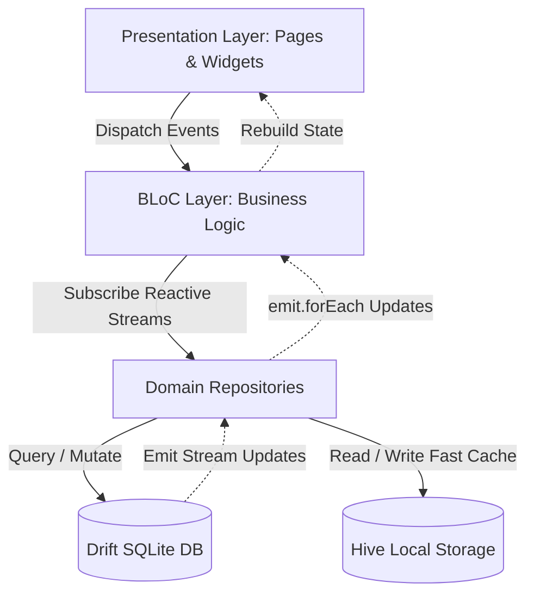

# LevelUp Money Life (Mobile App) 🚀

<div align="center">


<p align="center">
  <b>แอปพลิเคชันบริหารจัดการการเงินส่วนบุคคลระดับมือโปร ผสานระบบ Gamification RPG และ Reactive Drift SQLite Architecture</b><br>
  บันทึกรายรับ-รายจ่ายความเร็วสูงใน 3 วินาทีด้วย SmartNumpad & QuickTemplate พร้อมระบบวิเคราะห์งบประมาณ 50/30/20
</p>

</div>

---

## 📑 สารบัญ (Table of Contents)

1. [ไฮไลต์และฟีเจอร์เด่น (Key Highlights)](#-ไฮไลต์และฟีเจอร์เด่น-key-highlights)
2. [สถาปัตยกรรมระบบ (System Architecture)](#-สถาปัตยกรรมระบบ-system-architecture)
3. [เทคโนโลยีและเครื่องมือ (Tech Stack)](#-เทคโนโลยีและเครื่องมือ-tech-stack)
4. [โครงสร้างโปรเจกต์ (Project Structure)](#-โครงสร้างโปรเจกต์-project-structure)
5. [คู่มือการเริ่มต้นพัฒนา (Getting Started)](#-คู่มือการเริ่มต้นพัฒนา-getting-started)
6. [การสร้างโค้ดอัตโนมัติ (Code Generation)](#-การสร้างโค้ดอัตโนมัติ-code-generation)
7. [การทดสอบคุณภาพ (Testing & Quality Assurance)](#-การทดสอบคุณภาพ-testing--quality-assurance)
8. [การ Build และ Deployment](#-การ-build-และ-deployment)
9. [ข้อตกลงและแนวทางการเขียนโค้ด (Coding Standards)](#-ข้อตกลงและแนวทางการเขียนโค้ด-coding-standards)

---

## 🌟 ไฮไลต์และฟีเจอร์เด่น (Key Highlights)

### 1. ⚡ High-Speed All-in-One QuickAdd Sheet & SmartNumpad
- **แป้นตัวเลขอัจฉริยะ (SmartNumpad)**: คีย์บอร์ดสัมผัสเร็วในตัวพร้อมระบบคำนวณเลขบวกลบ (`+`, `-`) และ Haptic Feedback
- **บันทึกจบใน 3 วินาที**: รวมการเลือกประเภท (รายรับ/รายจ่าย), หมวดหมู่, ยอดเงิน, โน้ต และปุ่มส่งข้อมูลไว้ในหน้าต่าง Bottom Sheet เดียว
- **ระบบปักหมุด ⭐**: กดดาวเพื่อบันทึกรายการโปรดเป็น Template ส่วนตัวลง Hive Storage

### 2. 🪄 QuickTemplate Engine & Frequency Detection
- **1-Tap Shortcut Ribbon**: แถบชิปรายการด่วนด้านบนคีย์บอร์ด บันทึกยอดเงินและหมวดหมู่อัตโนมัติด้วยการแตะเพียงครั้งเดียว
- **อัลกอริทึมเรียนรู้พฤติกรรม**: วิเคราะห์ประวัติธุรกรรมเพื่อแนะนำ **Top 5 Frequent Items** ที่ใช้บ่อยที่สุด

### 3. 🔄 Reactive Drift SQLite Streams (Real-time Sync)
- **Local-First Reactive Architecture**: ใช้ Drift SQLite `watchTransactions()` กระจาย Stream ไปยัง `DashboardBloc`, `BudgetBloc`, และ `TransactionBloc`
- **Zero Manual Reloads**: ทุกการเพิ่ม ลบ หรือแก้ไขข้อมูล จะอัปเดตหน้า Dashboard, กราฟ Analytics, และงบประมาณทันทีแบบ Real-time ข้ามแท็บ

### 4. 🎮 Gamification RPG Progression & Non-blocking Feedback
- **Level & Rank Mastery**: คำนวณเลเวลและแรงค์จากค่าประสบการณ์รวม (Novice, Tactician, Strategist, Guardian, Sovereign, Maestro)
- **Floating XP Toast**: แจ้งเตือนรับคะแนน `+XP` (พร้อมโบนัส +5 XP เมื่อกรอกโน้ต) แบบ Toast ด้านบน ไม่ขัดจังหวะการบันทึกรายการถัดไป
- **Daily Quests & Streak System**: ภารกิจทางการเงินรายวันและตัวคูณความต่อเนื่องของการบันทึก (Streak Days)

### 5. 📊 50/30/20 Budgeting & Visual Financial Analytics
- **Budget Bucket Allocation**: แบ่งสัดส่วนค่าใช้จ่ายตามหลัก 50% Needs, 30% Wants, 20% Savings พร้อมแถบสีแจ้งเตือน Overbudget
- **Cash Flow Visualization**: กราฟแสดงสัดส่วนรายรับ-รายจ่ายและยอดเงินออมสุทธิประจำเดือน

### 6. 🎛️ Compact CommandDeck & SettingsSheet Hub
- **Slim Navigation Bar (~60px)**: ดีไซน์มินิมอล พร้อมตัวสลับเดือน (Month Switcher) ที่ซิงค์ทุก BLoC พร้อมกัน
- **Settings & Data Management**: สลับธีม 3 รูปแบบ (`System` / `Light` / `Dark`), สลับภาษา (`TH` / `EN`), และระบบ **Export/Import ข้อมูลสำรอง JSON แบบ Offline 100%**

---

## 🏗️ สถาปัตยกรรมระบบ (System Architecture)

โปรเจกต์ได้รับการออกแบบตามหลัก **Clean Architecture** และ **Feature-Driven Pattern**:



---

## 🛠️ เทคโนโลยีและเครื่องมือ (Tech Stack)

| หมวดหมู่ | เทคโนโลยี / ไลบรารี | วัตถุประสงค์การใช้งาน |
| :--- | :--- | :--- |
| **Core Framework** | `Flutter 3.38.9` / `Dart ^3.10.8` | Cross-Platform Mobile Engine |
| **State Management** | `flutter_bloc` & `equatable` | จัดการ State แบบ Event-Driven ปลอด Side-effects |
| **Dependency Injection** | `get_it` | Service Locator & Dependency Inversion |
| **Routing** | `auto_route` & `auto_route_generator` | Deep-linking & Strongly-typed Route Navigation |
| **Local Relational DB** | `drift` & `drift_flutter` | SQLite ORM รองรับ Reactive Query Streams และ Schema Migrations |
| **Key-Value Storage** | `hive` & `hive_flutter` | NoSQL Local Storage ความเร็วสูงสำหรับ QuickTemplates & Preferences |
| **UI Design System** | `flutter_tailwind_colors`, `toastification` | Design Tokens, Spacing Scale, Non-blocking Toasts |
| **Internationalization** | `flutter_localizations` & `intl` | จัดการภาษา TH/EN แบบ Type-safe ผ่าน `.arb` |

---

## 📁 โครงสร้างโปรเจกต์ (Project Structure)

```bash
lib/
├── config/                        # Environment & Global App Configuration
├── domain/                        # Core Business Logic & Data Contracts
│   ├── datasource/                # SQLite (Drift) & NoSQL (Hive) Data Sources
│   ├── models/                    # Domain Entities (Transaction, Budget, Gamification, QuickTemplate)
│   ├── repositories/              # Repository Contracts & Implementations
│   └── services/                  # Core Engines (GamificationEngine, QuickTemplateService)
├── feature/                       # Presentation Features (Feature-Driven Structure)
│   ├── dashboard/                 # Overview Dashboard, BentoCards, RPG HUD
│   ├── budget/                    # 50/30/20 Budgeting & Allocation Sliders
│   ├── gamification/              # Quest Hub, Achievement Badges, Progression
│   ├── transaction/               # Transaction Ledger, Filters, Slip Scanner, QuickAddSheet
│   └── home/                      # Shell Scaffolding & Navigation Hub
├── i18n/                          # Multi-language Localizations (TH / EN)
├── router/                        # AutoRoute Configuration & Guards
├── shared/                        # Shared Design System & Reusable Components
│   ├── bloc/                      # AppGlobalBloc, LanguageBloc
│   ├── components/                # HeaderCommandDeck, SmartNumpad, SettingsSheet, FloatingXpToast
│   └── tokens/                    # PColor Tokens, Spacing, Typography
├── locator.dart                   # Dependency Injection Service Locator
└── main.dart                      # Application Entry Point
```

---

## 🚀 คู่มือการเริ่มต้นพัฒนา (Getting Started)

### ข้อกำหนดเบื้องต้น (Prerequisites)
- [FVM (Flutter Version Management)](https://fvm.app/) หรือ Flutter SDK `3.38.9`
- Dart SDK `^3.10.8`
- Android Studio / Xcode

### ขั้นตอนการติดตั้งและรันโปรเจกต์

1. **Clone repository:**
   ```bash
   git clone https://github.com/Theeraphat-S/LevelUp-Money-Life-Mobile.git
   cd LevelUp-Money-Life-Mobile
   ```

2. **เลือกใช้ Flutter SDK ผ่าน FVM:**
   ```bash
   fvm use 3.38.9
   ```

3. **ติดตั้ง Package Dependencies:**
   ```bash
   fvm flutter pub get
   ```

4. **สร้าง Generated Code (Drift Database, AutoRoute):**
   ```bash
   dart run build_runner build --delete-conflicting-outputs
   ```

5. **รัน Application:**
   ```bash
   fvm flutter run
   ```

---

## ⚙️ การสร้างโค้ดอัตโนมัติ (Code Generation)

### 1. Drift Database & AutoRoute
เมื่อมีการแก้ไขตาราง SQLite หรือสร้างหน้า Route ใหม่:
```bash
# Build รอบเดียว
dart run build_runner build --delete-conflicting-outputs

# หรือรันในโหมด Watch
dart run build_runner watch --delete-conflicting-outputs
```

### 2. ระบบแปลภาษา (i18n Localization)
โปรเจกต์มีสคริปต์รวมคำแปลอัตโนมัติ:
```bash
./generate_i18n.sh
```

---

## 🧪 การทดสอบคุณภาพ (Testing & Quality Assurance)

โปรเจกต์ให้ความสำคัญกับความถูกต้องของระบบการเงินและ UX ด้วย Automated Test Suites:

```bash
# รันการวิเคราะห์ Static Analysis
flutter analyze

# รันชุดแบบทดสอบทั้งหมด
flutter test
```

### รายการ Test Coverage หลัก (31/31 Tests Passed):
- **Drift SQLite Reactive Streams**: ตรวจสอบการปล่อย Stream ข้อมูลอัตโนมัติเมื่อเกิด Transaction CRUD
- **Gamification Engine**: ตรวจสอบสูตรคำนวณเลเวล, Streak Multiplier, รางวัล +XP, และการปลดล็อก Achievements
- **SmartNumpad Math Parser**: ตรวจสอบการคำนวณนิพจน์คณิตศาสตร์ (`+`, `-`, ทศนิยม)
- **QuickTemplate Engine**: ตรวจสอบการบันทึก, กรองหมวดหมู่, และ Serializer
- **Responsive Layout & Overflow Tests**: ทดสอบการแสดงผลบนหน้าจอขนาดมาตรฐาน (360dp) และหน้าจอขนาดเล็กพิเศษ (320dp) ปราศจาก RenderFlex Overflow 100%

---

## 📦 การ Build และ Deployment

### Android APK:
```bash
# Development Build
./build_apk_dev.sh

# Production Release Build
./build_apk_prod.sh
```

### iOS IPA (Fastlane & Archive):
```bash
cd ios && pod install
fvm flutter build ipa --release
```

---

## 📐 ข้อตกลงและแนวทางการเขียนโค้ด (Coding Standards)

- **Domain Terminology**: ยึดตาม [`CONTEXT.md`](file:///CONTEXT.md) อย่างเคร่งครัด
  - ใช้ `Transaction`, `SmartNumpad`, `QuickTemplate`, `GamificationEngine`, `FloatingXpToast`, `CommandDeck`
- **Immutability & State**: ใช้ `Equatable` สำหรับ State และ Events ทุกตัวใน BLoC
- **Reactive Stream Handling**: รับฟังการเปลี่ยนแปลงข้อมูลจาก Database ผ่าน `emit.forEach` เพื่อหลีกเลี่ยง Side-effects
- **Localization**: รองรับ 2 ภาษา (`TH` และ `EN`) ผ่าน `CategoryItem.getLocalizedCategoryName` และ `AppLocalizations`

---

## 👥 ผู้พัฒนาและการติดต่อ (Authors & License)

- **Repository:** [Theeraphat-S/LevelUp-Money-Life-Mobile](https://github.com/Theeraphat-S/LevelUp-Money-Life-Mobile)
- **License:** MIT Licensebuild อัตโนมัติเมื่อไฟล์เปลี่ยน
dart run build_runner watch --delete-conflicting-outputs
```

### 2. ระบบแปลภาษา (i18n / Localization)

โปรเจกต์มีสคริปต์ `generate_i18n.sh` ที่ช่วยรวบรวมไฟล์ `.arb` จากทุกโฟลเดอร์ใน `lib/i18n/locals/`:

- เมื่อต้องการเพิ่มหน้าใหม่ (เช่น `quest_page`):
  1. สร้างโฟลเดอร์ `lib/i18n/locals/quest_page/`
  2. สร้างไฟล์ `en.arb` และ `th.arb`
  3. รันคำสั่ง:
     ```bash
     ./generate_i18n.sh
     ```
  4. สคริปต์จะสร้างคลาส Localization และอัปเดตไฟล์ `lib/i18n/i18n.dart` ให้อัตโนมัติ

---

## 💻 คำสั่งและสคริปต์สำหรับการพัฒนา (Development Scripts)

### สร้าง Feature ใหม่ด้วย Script

โปรเจกต์มีสคริปต์ `create_feature.sh` สำหรับ Scaffold โครงสร้าง BLoC, Models, Page, Widgets ของ Feature ใหม่อย่างรวดเร็ว:

```bash
chmod +x create_feature.sh

# รูปแบบคำสั่ง:
# ./create_feature.sh <feature_name> [--appbar|-a] [--bottombar|-b]

# ตัวอย่างการสร้าง:
./create_feature.sh budget
./create_feature.sh profile --appbar
```

### Flavors & การ Build แอป

โปรเจกต์รองรับ 3 Flavors ได้แก่ `local`, `dev`, และ `prod`:

#### การรันตาม Flavor
```bash
# รันโหมด Dev
fvm flutter run --flavor dev -t lib/main.dart --dart-define=flavor=dev

# รันโหมด Prod
fvm flutter run --flavor prod -t lib/main.dart --dart-define=flavor=prod
```

#### การ Build ผ่าน Shell Script & Batch File

- **Android (APK):**
  ```bash
  ./build_apk_dev.sh     # Build APK สำหรับ Dev
  ./build_apk_prod.sh    # Build APK สำหรับ Production
  ```
- **Windows Desktop:**
  ```cmd
  build_windows_dev.bat
  build_windows_prod.bat
  ```
- **iOS (IPA):**
  ```bash
  ./build_ipa_dev.sh
  ```

---

## 💽 ฐานข้อมูลและการจัดเก็บข้อมูล (Storage & Database)

### Drift (SQLite)

- จัดเก็บตารางข้อมูลหลักแบบ Relation
- ไฟล์คอนฟิก: [app_database.dart](file:///lib/domain/datasource/app_database.dart)
- วิธีดึงไฟล์ฐานข้อมูลจาก Android Emulator ออกมาดู:
  ```bash
  adb exec-out run-as com.fldp.mobileApp cat /data/data/com.fldp.mobileApp.dev/app_flutter/db.sqlite > local_db.sqlite
  ```

### Hive (Local Cache / Key-Value)

- ใช้สำหรับเก็บการตั้งค่า, ข้อมูล Session, Token หรือ Cache ความเร็วสูง
- จัดการผ่าน [hive_config.dart](file:///lib/domain/datasource/hive_config.dart):
  ```dart
  import 'package:mobile_app_standard/domain/datasource/hive_config.dart';

  final box = await HiveConfig.openBox<String>('cache_box');
  await box.put('key', 'value');
  final value = box.get('key');
  ```

---

## 📐 แนวทางการเขียนโค้ด (Best Practices & Conventions)

### การตั้งชื่อ (Naming Conventions)
- **ไฟล์และโฟลเดอร์:** ใช้ `lowercase_with_underscores` เช่น `transaction_bloc.dart`, `rpg_hud_card.dart`
- **คลาสและ Type:** ใช้ `UpperCamelCase` เช่น `DashboardBloc`, `TransactionModel`
- **ตัวแปรและฟังก์ชัน:** ใช้ `lowerCamelCase` เช่น `fetchUserData()`, `dailyQuests`
- **ตัวแปร Private:** ขึ้นต้นด้วย `_` เช่น `_appRouter`, `_currentHp`
- **Constants:** ใช้ `UPPER_CASE` หรือ `lowerCamelCase` ให้สอดคล้องกัน

### การจัดการ Dependency Injection
- ทำการ Register dependencies, Blocs และ Repositories ใน [lib/locator.dart](file:///lib/locator.dart)
- สำหรับ Repository และ Client ใช้ `registerLazySingleton`
- สำหรับ BLoC ของ Feature แต่ละหน้าใช้ `registerFactory`

---

## 📱 การ Build และ Deploy สำหรับ iOS / Android

### Fastlane

ติดตั้งและตั้งค่า Fastlane สำหรับ automate การ build และ deploy:

```bash
# ติดตั้ง Fastlane (macOS)
brew install fastlane

# ตรวจสอบการติดตั้ง
fastlane --version

# เรียกใช้งานผ่าน Bundle
bundle install
bundle exec fastlane [lane_name]
```

### iOS Setup & Code Signing

1. เปิด Workspace ใน Xcode:
   ```bash
   open ios/Runner.xcworkspace
   ```
2. ติดตั้ง CocoaPods:
   ```bash
   cd ios && pod install
   ```
3. ตั้งค่า **Signing & Capabilities** โดยเลือก Development Team และ Bundle Identifier
4. สำหรับการ Release สู่ TestFlight/App Store ใช้ `fvm flutter build ipa --release` หรืออัปโหลดผ่าน **Transporter** / `xcrun notarytool`

---

## 👥 Authors & License

- **Repository:** [LevelUp-Money-Life-Mobile](https://github.com/Theeraphat-S/LevelUp-Money-Life-Mobile)
- พัฒนาเพื่อการเรียนรู้และยกระดับการบริหารการเงินส่วนบุคคล
